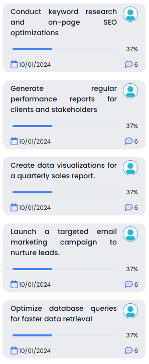

# Overview

Iterate on data for smarter designs by using the custom component **"Virtualizer"**. This component enables iteration over a Qodly Source to display dynamic Stylebox components with various heights depending on the content of each virtualizer's item.

## Virtualizer

- **Horizontal Virtualizer:**


- **Vertical Virtualizer:**



- **Grid Virtualizer:**


## Properties

| Name        | Attribute     | Type  | Default  | Description                                                                                                        |
| ----------- | ------------- | ----- | -------- | ------------------------------------------------------------------------------------------------------------------ |
| Orientation | `orientation` | radio | Vertical | Type of direction to show the items of the component. There are three possible values: Horizontal, Vertical & Grid |

## Data Access

| Name             | Type             | Required | Description                                                                                                                |
| ---------------- | ---------------- | -------- | -------------------------------------------------------------------------------------------------------------------------- |
| Qodly Source     | Entity Selection | Yes      | Specifies the selection of entities to be displayed as data in the component                                               |
| Selected Element | Entity           | No       | Each item of the virtualizer is featured by this property once it's selected                                               |
| Iterate With     | string           | No       | Determines the entity used for iteration within the virtualizer component. By default, the value of the iterator is: $This |
| Server Side      | string           | No       | Includes a reference that users can use for executing server-side actions related to it                                    |

## Custom CSS

To eliminate the default purple background of the element that is selected, you can write the following CSS style and attach it to the virtualizer:

```css
self .virtualizer-list .virtualizer-item.selected {
  background-color: transparent;
}
```
